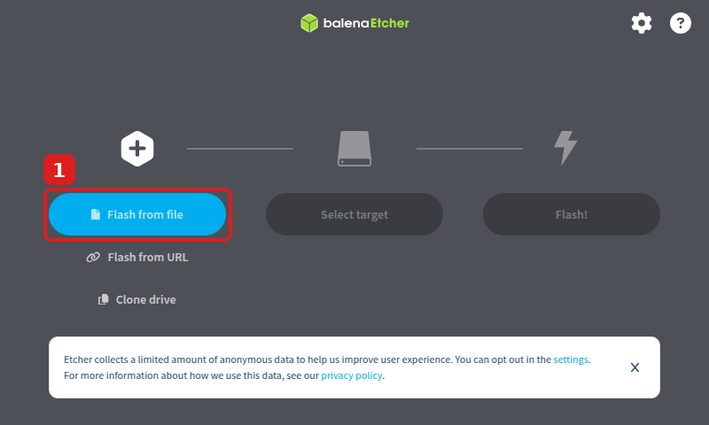

# 3 · balenaEtcher herunterladen und installieren (Windows 10)

**Ziel:** Das Programm **balenaEtcher** installieren. Damit wird später Ubuntu auf den USB-Stick geschrieben.

⏱️ ca. 5 Minuten · 🌐 Internet nötig · Stand: **Version 2.1.7** (September 2026)

---

## Schritt 1 – Download starten

**Weg A – direkter Link (einfachster Weg):**

👉 Diesen Link in Firefox anklicken:

**https://github.com/balena-io/etcher/releases/download/v2.1.7/balenaEtcher-2.1.7.Setup.exe**

**Weg B – offizielle Webseite (falls es eine neuere Version gibt):**

1. 👉 **https://etcher.balena.io/** öffnen.
2. 👉 Beim Download den Eintrag für **Windows** wählen, der **Installer** und **x64** heißt (nicht „Portable“).

> ℹ️ Die Datei heißt **balenaEtcher-2.1.7.Setup.exe** und ist ca. **200 MB** groß (bei neuerer Version andere Nummer).

## Schritt 2 – Warten bis der Download fertig ist

⏳ Die Datei landet im Ordner **Downloads**.

## Schritt 3 – Installation starten

1. ⌨️ **Windows** + **E** → links **Downloads** anklicken.
2. 👉 Doppelklick auf **balenaEtcher-2.1.7.Setup.exe**.

## Schritt 4 – Installation läuft von allein

⏳ Das Setup stellt keine Fragen. Kurz warten.

➡️ Danach öffnet sich **balenaEtcher** automatisch:

✅ **Fertig!** So sieht balenaEtcher aus. Das Programm ist auf **Englisch** – das ist normal.

## Schritt 5 – Datenschutz-Hinweis (optional)

Unten steht ein Hinweis zu anonymen Nutzungsdaten.
👉 Mit **X** schließen. Wer das abschalten will: oben rechts **⚙ (Zahnrad)** = **settings**.

## Schritt 6 – Programm später wiederfinden

👉 **Start**-Knopf (Windows-Logo unten links) → **balenaEtcher** eintippen → anklicken.

---

## ❓ Probleme

| Problem | Lösung |
|---|---|
| Blaues Fenster **„Der Computer wurde durch Windows geschützt“** | 👉 **Weitere Informationen** → **Trotzdem ausführen** – nur, wenn die Datei von einem der beiden Links oben stammt. |
| Firefox fragt, was mit der Datei passieren soll | 👉 **Datei speichern** wählen. |
| Download bricht ab | Schritt 1 wiederholen. |

➡️ Weiter mit [4 · Ubuntu ISO herunterladen und auf Stick schreiben](04-ubuntu-server-iso-herunterladen-und-auf-usb-stick-schreiben.md)
