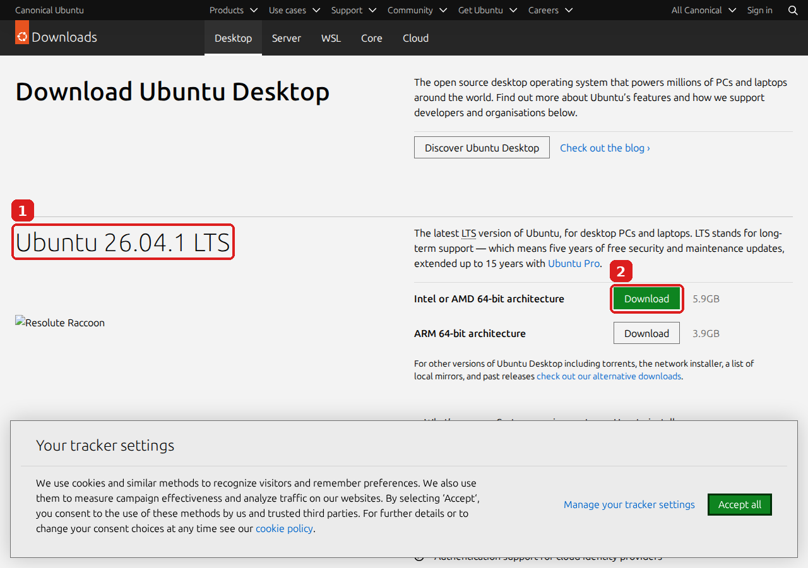
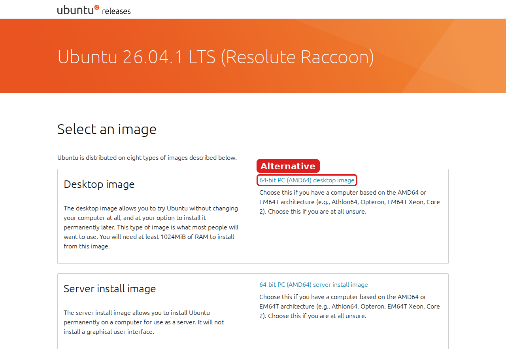
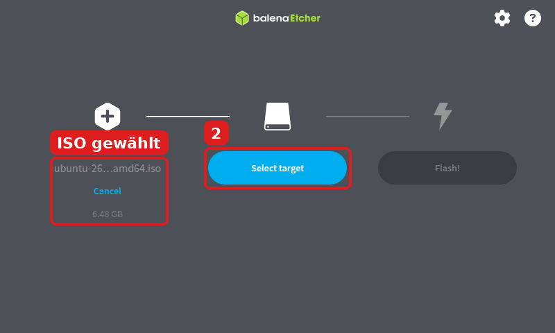
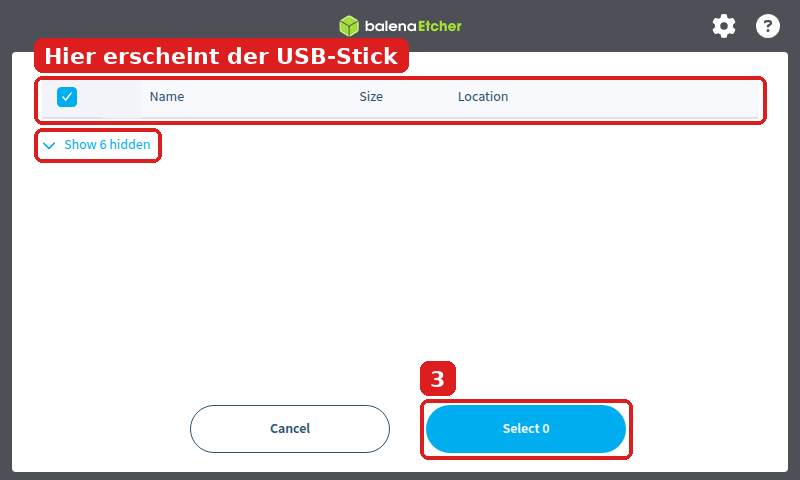

# 4 · Ubuntu Desktop ISO herunterladen und auf USB-Stick schreiben

**Ziel:** Die neueste **Ubuntu Desktop** Installationsdatei (**ISO**, für **amd64**) herunterladen und mit **balenaEtcher** auf den leeren Stick **„UBUNTU“** schreiben.

⏱️ ca. 30–60 Minuten · 🌐 Internet nötig · 🟧 USB-Stick **„UBUNTU“** (mind. 8 GB)

> 🔴 **Alles auf dem Stick „UBUNTU“ wird gelöscht!** Stick **„DATEN“** vorher **abziehen**.

Stand 26.09.2026: neueste Version = **Ubuntu 26.04.1 LTS**, Datei **ubuntu-26.04.1-desktop-amd64.iso** (ca. **6,5 GB**).

> 💻 Ubuntu nennt als Mindestanforderung u. a. **6 GB Arbeitsspeicher** und **25 GB freien Festplattenplatz**. RAM prüfen in Windows: **Start** → **Einstellungen** → **System** → **Info** → **Installierter RAM**.

---

## Teil A – ISO herunterladen

### Schritt 1 – Download-Seite öffnen

👉 In Firefox öffnen: **https://ubuntu.com/download/desktop**



1. Hier steht die aktuelle Version (**Ubuntu 26.04.1 LTS**).
2. 👉 Neben **Intel or AMD 64-bit architecture** auf den grünen Knopf **Download** klicken (**5.9GB**).
   ❌ **Nicht** den Knopf bei **ARM 64-bit architecture** – der ist für andere Geräte.

> ℹ️ Unten erscheint evtl. ein Cookie-Fenster (**Your tracker settings**). Einfach eine Auswahl treffen – egal welche.

⏳ Eine Dankeschön-Seite erscheint, der Download startet von selbst. Das dauert je nach Internet einige Minuten.

**Alternative:** Die offizielle Release-Seite **https://releases.ubuntu.com/26.04.1/** → **64-bit PC (AMD64) desktop image**:



### Schritt 2 – Download prüfen

👉 Im Ordner **Downloads** muss liegen: **ubuntu-26.04.1-desktop-amd64.iso** (ca. 6,5 GB)

<details>
<summary>🔍 Optional: Echtheit prüfen (für Fortgeschrittene)</summary>

1. Im Ordner **Downloads**: **Shift** gedrückt halten + Rechtsklick auf leere Fläche → **PowerShell-Fenster hier öffnen**.
2. Eintippen und **Enter**:
   ```
   Get-FileHash .\ubuntu-26.04.1-desktop-amd64.iso
   ```
3. Die angezeigte Zahlen-/Buchstabenkette muss **genau** so lauten:
   ```
   601E30FBF5D97759367C632E2C33630665039B7E2158FD068403DA3CCF1BDA1F
   ```
   (Quelle: https://releases.ubuntu.com/26.04.1/SHA256SUMS)
</details>

---

## Teil B – ISO mit balenaEtcher auf den Stick schreiben

### Schritt 3 – Stick einstecken, Etcher starten

1. 🟦 Stick **„DATEN“** abziehen (falls noch drin).
2. 🟧 Stick **„UBUNTU“** einstecken.
3. 👉 **Start** → `balenaEtcher` eintippen → öffnen.

### Schritt 4 – ISO auswählen

👉 **Flash from file** klicken.


👉 Im Fenster **Downloads** öffnen → **ubuntu-26.04.1-desktop-amd64.iso** anklicken → **Öffnen**.

### Schritt 5 – Stick als Ziel wählen

Links steht jetzt der Name der ISO und **6.48 GB**.
👉 **Select target** klicken.



### Schritt 6 – Den richtigen Stick ankreuzen



1. 👉 In der Liste den **USB-Stick** ankreuzen. Erkennen an **Name** und **Size** (Größe, z. B. „8 GB“ oder „16 GB“).
2. 👉 **Select 1** klicken (im Bild steht „Select 0“, weil hier noch kein Stick angekreuzt ist).

> ⚠️ **Show … hidden** (links, eingerahmt) **nicht** anklicken! Dort versteckt Etcher Laufwerke wie die interne Festplatte.
> ⚠️ Nicht sicher, welcher Eintrag der Stick ist? → **Cancel**, Stick abziehen, wieder einstecken und schauen, welcher Eintrag verschwindet/erscheint.

### Schritt 7 – Schreiben starten

1. 👉 **Flash!** klicken.
2. Windows fragt: **„Möchten Sie zulassen, dass durch diese App Änderungen an Ihrem Gerät vorgenommen werden?“** → 👉 **Ja**.

### Schritt 8 – Warten

Etcher zeigt nacheinander:

| Anzeige | Bedeutung |
|---|---|
| **Starting...** | Vorbereitung |
| **Flashing...** | Ubuntu wird auf den Stick geschrieben |
| **Validating...** | Etcher prüft, ob alles richtig geschrieben wurde |
| **Flash Completed!** | ✅ Fertig! |

⏳ Stick in dieser Zeit **nicht abziehen**.

### Schritt 9 – Fertig

✅ Bei **Flash Completed!** ist der Stick bereit. balenaEtcher schließen.

> 🪟 **Windows meldet jetzt evtl.: „Sie müssen den Datenträger … formatieren“** → 👉 **Abbrechen** klicken! **Nicht formatieren**, sonst ist der Ubuntu-Stick kaputt. Das ist normal: Windows kann den Linux-Stick nicht lesen.

---

## ❓ Probleme

| Problem | Lösung |
|---|---|
| **Flash Failed.** | Anderen USB-Anschluss oder anderen Stick nehmen, ab Schritt 4 wiederholen. |
| Stick erscheint nicht in der Liste | Abziehen, neu einstecken, ein paar Sekunden warten. |

➡️ Weiter mit [5 · BIOS einstellen und vom USB-Stick starten](05-hp-elitebook-840-g3-bios-und-usb-start.md)
