# 5 · HP EliteBook 840 G3: BIOS einstellen, vom USB-Stick starten und Ubuntu installieren

**Ziel:** Das BIOS so einstellen, dass der Laptop vom Stick **„UBUNTU“** startet, und **Ubuntu Desktop** installieren.

⏱️ ca. 1 Stunde · 🟧 Stick **„UBUNTU“** (aus Anleitung 4) · 🔌 **Netzteil anschließen**

> ⚠️ Vorher erledigt? [1 · Ordner sichern](01-persoenliche-ordner-auf-usb-stick-sichern.md) und [2 · Firefox exportieren](02-firefox-lesezeichen-und-passwoerter-exportieren.md)

---

## ⌨️ Die wichtigen Tasten

Direkt nach dem Einschalten (solange das **HP-Logo** zu sehen ist) **mehrmals** drücken:

| Taste | Öffnet |
|:---:|---|
| **Esc** | **Startup Menu** (Auswahlmenü) |
| **F10** | **BIOS Setup** (Einstellungen) |
| **F9** | **Boot Device Options** (vom USB-Stick starten) |

Im BIOS: **Pfeiltasten** zum Bewegen, **Enter** zum Auswählen, **Esc** zurück. Touchpad/Maus funktioniert meist auch.

> ℹ️ Vom HP-BIOS gibt es hier **keine Fotos**. Die Menünamen (englisch, **fett**) stammen aus HP-Unterlagen und Berichten von 840-G3-Besitzern. Je nach BIOS-Version kann die Anordnung leicht abweichen – **nach dem Namen suchen**.

---

## Teil A – BIOS einstellen

### Schritt 1 – Stick einstecken

🟧 Stick **„UBUNTU“** einstecken. 🟦 Stick **„DATEN“** abziehen.

### Schritt 2 – Neu starten und BIOS öffnen

1. 👉 In Windows: **Start** → **Ein/Aus** → **Neu starten**.
2. ⌨️ Sobald der Bildschirm schwarz wird: **F10** mehrmals drücken (ca. 1× pro Sekunde).

➡️ **BIOS Setup** öffnet sich. Oben sind Reiter wie **Main**, **Security**, **Advanced**.

> Windows startet trotzdem? → Nochmal, diesmal **Esc** drücken → im **Startup Menu** **F10** drücken.
> Fragt es nach einem **Passwort**? → Ein BIOS-Passwort ist gesetzt (z. B. bei Firmen-Laptops). Ohne dieses Passwort geht es nicht weiter.

### Schritt 3 – USB-Start erlauben

1. 👉 Reiter **Advanced** → **Boot Options**.
2. ✅ **USB Storage Boot** muss **angehakt** sein.
3. ⬅️ **Esc** / zurück zu **Advanced**.

### Schritt 4 – Secure Boot prüfen

1. 👉 **Advanced** → **Secure Boot Configuration**.
2. Bei **Configure Legacy Support and Secure Boot** gibt es drei Möglichkeiten:

| Einstellung | Wann? |
|---|---|
| **Legacy Support Disable and Secure Boot Enable** | ✅ **Zuerst so lassen** (Windows-Standard). Ubuntu kann mit Secure Boot starten. |
| **Legacy Support Disable and Secure Boot Disable** | 🔁 Nur wählen, **falls der Stick in Teil B nicht startet**. |
| **Legacy Support Enable and Secure Boot Disable** | ❌ Nicht nötig. |

> ⚠️ Der Laptop hat **UEFI**. Ubuntu wird im **UEFI-Modus** installiert – „Legacy“ brauchst du nicht.

### Schritt 5 – Speichern und verlassen

1. 👉 Reiter **Main** → **Save Changes and Exit**.
2. 👉 Mit **Yes** bestätigen.

### Schritt 6 – (Nur wenn Secure Boot geändert wurde) Code eingeben

Nach dem Neustart kann ein Hinweis erscheinen, dass eine Änderung des **Secure Boot** Modus aussteht, mit einer **4-stelligen Zahl**.

⌨️ Diese Zahl eintippen → **Enter**.

---

## Teil B – Vom USB-Stick starten

### Schritt 7 – Boot-Menü öffnen

1. 👉 Laptop einschalten bzw. neu starten.
2. ⌨️ Sofort **F9** mehrmals drücken (oder **Esc** → dann **F9**).

➡️ **Boot Device Options** erscheint.

### Schritt 8 – Stick auswählen

👉 Mit den Pfeiltasten den Eintrag mit **USB** im Namen wählen (unter **UEFI Boot Sources**) → **Enter**.

> ❌ Nicht **Windows Boot Manager** wählen – das startet Windows.

### Schritt 9 – Ubuntu-Startmenü (GRUB)

Ein schwarz-weißes Menü erscheint:

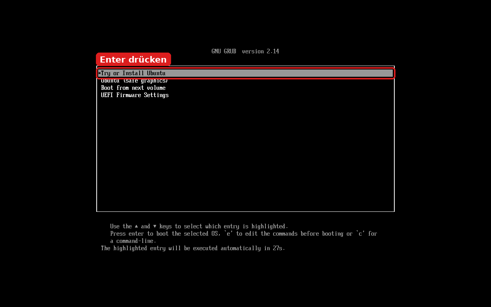

👉 **Try or Install Ubuntu** ist markiert → **Enter** drücken.
(Ohne Tastendruck startet es nach 30 Sekunden automatisch.)

> 💡 Bild bleibt schwarz oder verzerrt? → Neu starten und **Ubuntu (safe graphics)** wählen.
> 💡 **UEFI Firmware Settings** führt direkt ins BIOS.

⏳ Das Ubuntu-Logo erscheint. **Einige Minuten** warten, bis das Fenster **Welcome to Ubuntu** kommt.

---

## Teil C – Ubuntu installieren

Der Installer wird mit der **Maus/Touchpad** bedient. Unten rechts immer **Weiter** (vorher **Next**).

### Schritt 10 – Sprache

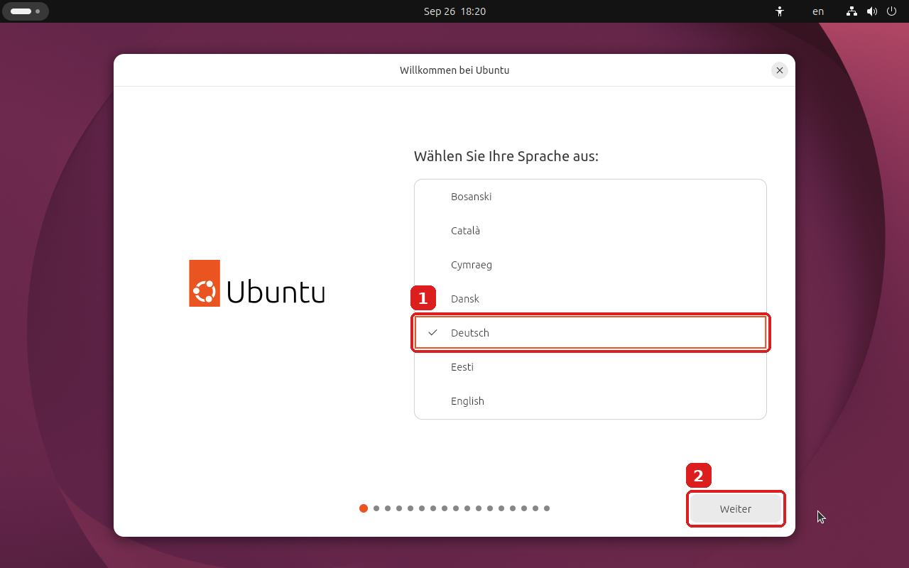

1. 👉 **Deutsch** anklicken – das Fenster wird sofort deutsch.
2. 👉 **Weiter**.

### Schritt 11 – Barrierefreiheit

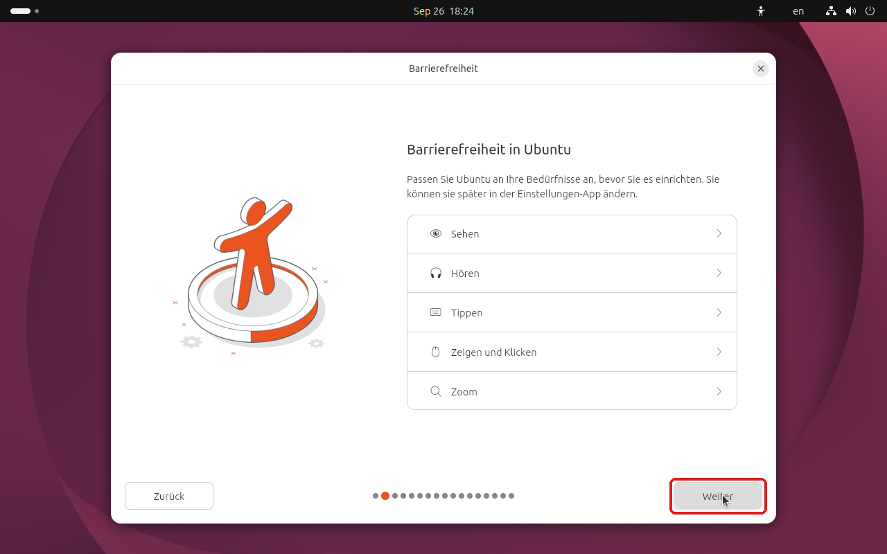

👉 Nichts ändern → **Weiter**.

### Schritt 12 – Tastatur

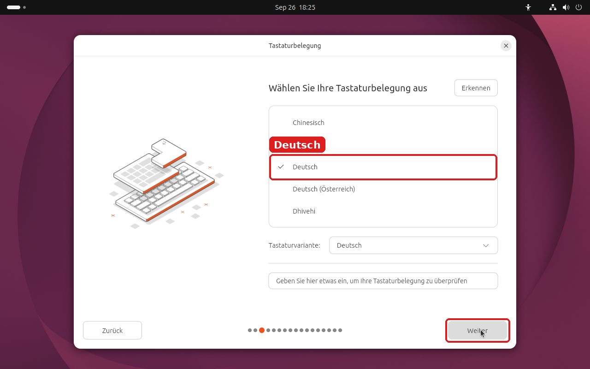

✅ **Deutsch** ist angehakt, **Tastaturvariante: Deutsch** → **Weiter**.

### Schritt 13 – Internet

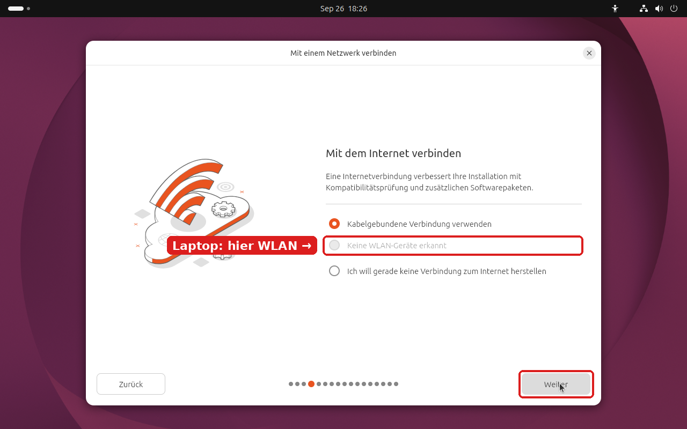

👉 **WLAN** auswählen, WLAN-Name anklicken und WLAN-Passwort eingeben → **Weiter**.

> ℹ️ Im Bild steht „Keine WLAN-Geräte erkannt“, weil es in einer virtuellen Maschine aufgenommen wurde. Auf dem Laptop stehen hier die WLAN-Netze. Ein LAN-Kabel geht auch (**Kabelgebundene Verbindung verwenden**).

### Schritt 14 – Installieren oder ausprobieren

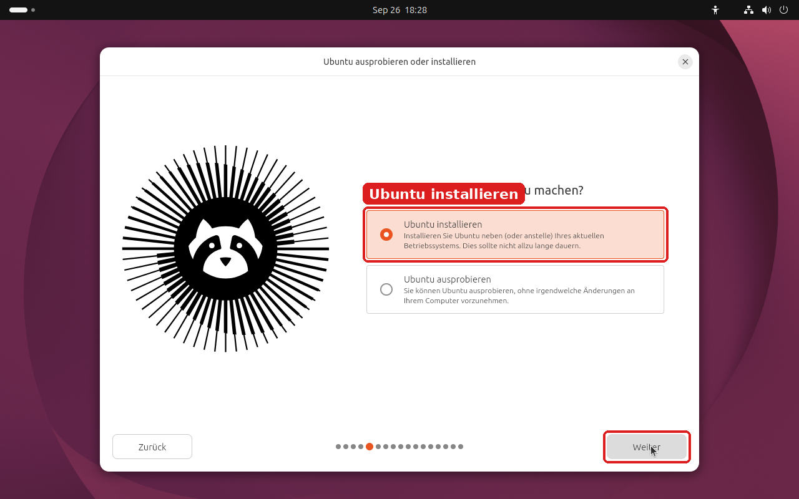

👉 **Ubuntu installieren** → **Weiter**.

> 💡 **Ubuntu ausprobieren** startet Ubuntu nur vom Stick (Live-System), **ohne** etwas am Laptop zu ändern – gut zum Testen, ob WLAN, Ton usw. funktionieren.

### Schritt 15 – Art der Installation

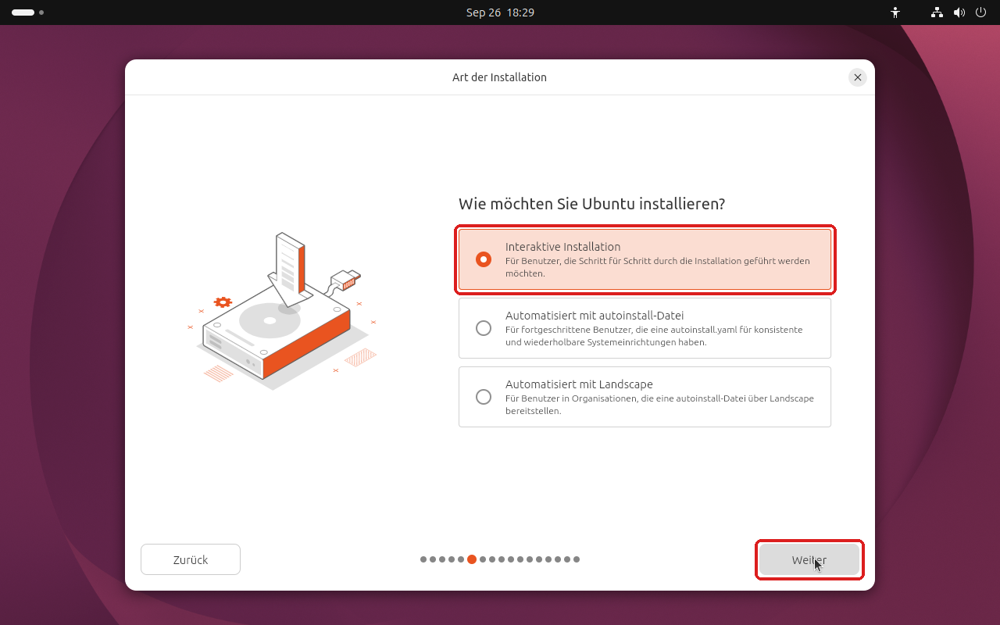

👉 **Interaktive Installation** → **Weiter**.

### Schritt 16 – Anwendungen

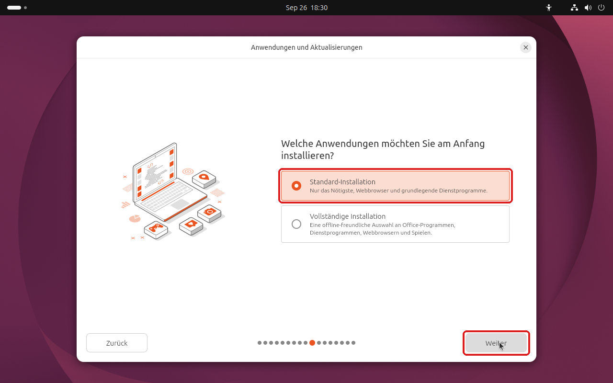

👉 **Standard-Installation** → **Weiter**.
(**Vollständige Installation** = zusätzlich Office-Programme, Spiele usw.)

### Schritt 17 – Zusatz-Software (optional)

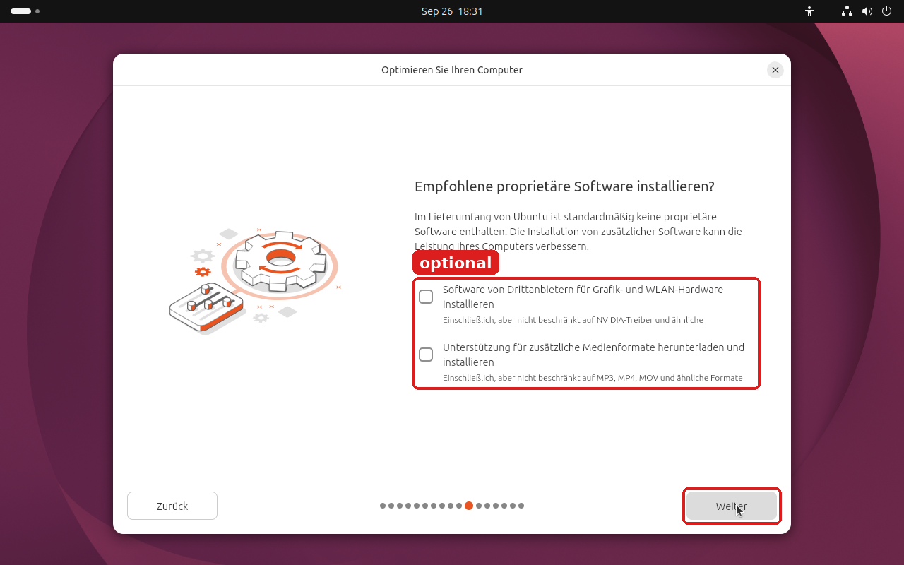

Wer z. B. **MP3/MP4** abspielen möchte: zweiten Haken setzen. Unsicher? Beide Haken setzen schadet nicht. → **Weiter**.

### Schritt 18 – 🔴 Festplatte

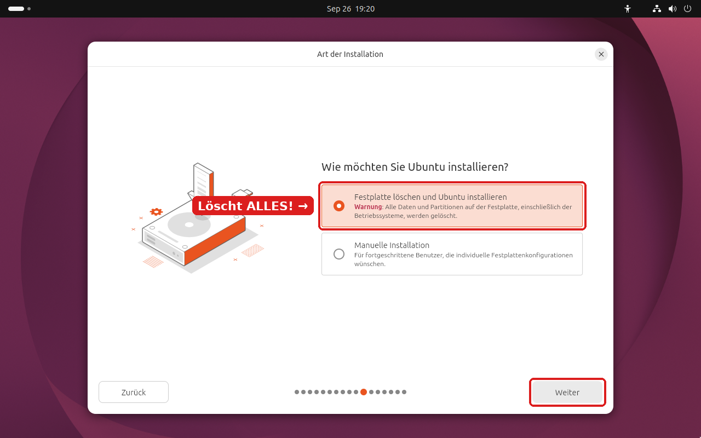

👉 **Festplatte löschen und Ubuntu installieren** → **Weiter**.

> 🔴 **Das löscht Windows und alle Dateien auf dem Laptop!** Nur weitermachen, wenn die Sicherung auf dem Stick **„DATEN“** kontrolliert ist ([Anleitung 1](01-persoenliche-ordner-auf-usb-stick-sichern.md), [Anleitung 2](02-firefox-lesezeichen-und-passwoerter-exportieren.md)).
> ℹ️ Das Bild stammt aus einer virtuellen Maschine mit leerer Festplatte. Auf dem Laptop mit Windows können hier **weitere Auswahlmöglichkeiten** stehen. Für „nur Ubuntu“ trotzdem **Festplatte löschen und Ubuntu installieren** wählen.

### Schritt 19 – Verschlüsselung

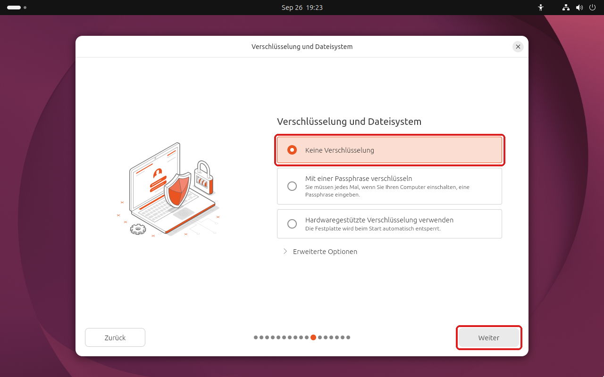

👉 **Keine Verschlüsselung** → **Weiter**.
(Wer den Laptop unterwegs nutzt, kann **Mit einer Passphrase verschlüsseln** wählen – dann muss bei **jedem Einschalten** diese Passphrase eingegeben werden. **Nicht vergessen!**)

### Schritt 20 – Benutzerkonto

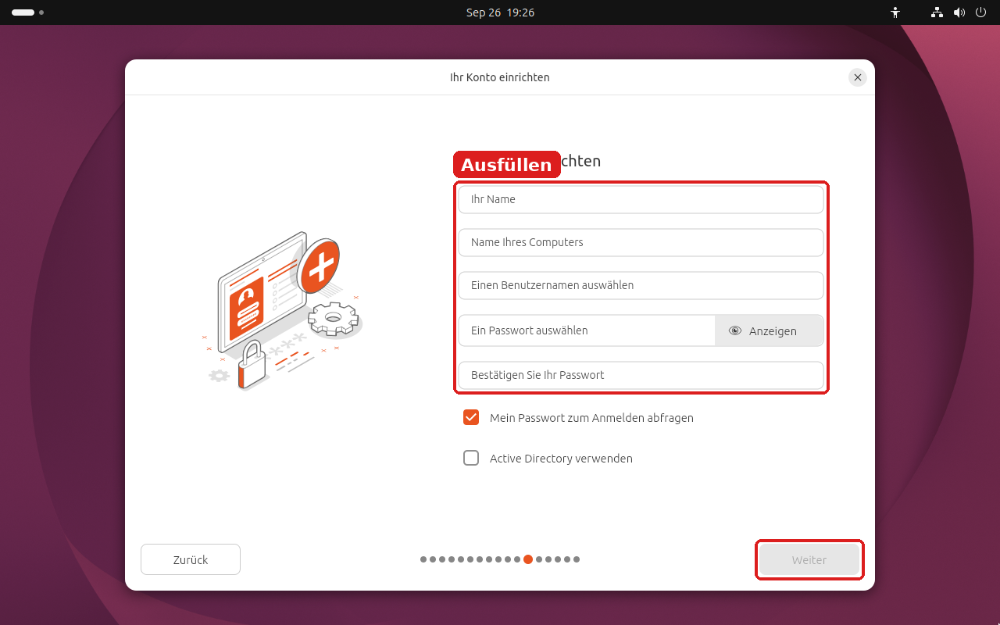

1. **Ihr Name** eintippen – Computername und Benutzername werden automatisch vorgeschlagen.
2. **Passwort** zweimal eingeben. ✍️ **Aufschreiben!**
3. 👉 **Weiter**.

### Schritt 21 – Zeitzone

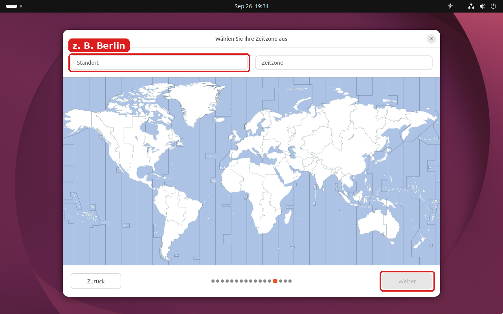

Bei **Standort** z. B. `Berlin` eintippen, sodass bei **Zeitzone** **Europe/Berlin** steht → **Weiter**.

### Schritt 22 – Installation starten und warten

1. Der Installer zeigt eine **Zusammenfassung**. Kurz prüfen, dann die Installation starten.
2. ⏳ Die Installation dauert je nach Laptop ca. 10–30 Minuten. **Netzteil dranlassen.**
3. Am Ende: **Neu starten** wählen. Wenn der Laptop dazu auffordert: **Stick abziehen** und **Enter** drücken.

✅ **Fertig!** Ubuntu startet und fragt nach dem Passwort aus Schritt 20.

---

## ❓ Probleme

| Problem | Lösung |
|---|---|
| Kein **USB**-Eintrag bei **F9** | Stick in anderen USB-Anschluss stecken. In **Schritt 3** prüfen: **USB Storage Boot** angehakt? |
| Stick startet nicht / Fehlermeldung zu Secure Boot | **Schritt 4**: **Legacy Support Disable and Secure Boot Disable** wählen, speichern, **Schritt 6** Code eingeben. |
| Windows startet einfach | **F9** früher und öfter drücken. |
| Bild schwarz oder verzerrt nach GRUB | Neu starten, in **Schritt 9** **Ubuntu (safe graphics)** wählen. |
| Nach der Installation startet wieder der Installer | Stick wurde nicht abgezogen. Abziehen, neu starten. |

---

**Bilder:** Startmenü und Installer sind echte Screenshots von **ubuntu-26.04.1-desktop-amd64.iso**, aufgenommen in einer virtuellen Maschine. Auf dem Laptop sind Texte und Knöpfe gleich; Größe, Hintergrund und die WLAN-/Festplatten-Einträge können anders aussehen.
