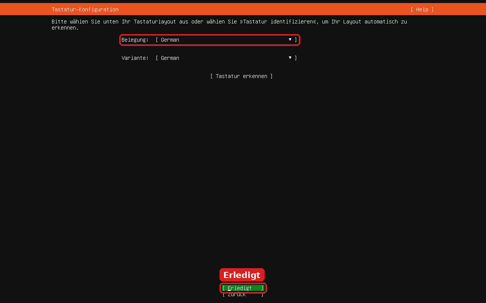

# 5 · HP EliteBook 840 G3: BIOS einstellen und vom USB-Stick starten

**Ziel:** Das BIOS so einstellen, dass der Laptop vom Stick **„UBUNTU“** startet, und den Ubuntu-Installer öffnen.

⏱️ ca. 15 Minuten · 🟧 Stick **„UBUNTU“** (aus Anleitung 4) · 🔌 **Netzteil anschließen**

> ⚠️ Vorher erledigt? [1 · Ordner sichern](01-persoenliche-ordner-auf-usb-stick-sichern.md) und [2 · Firefox exportieren](02-firefox-lesezeichen-und-passwoerter-exportieren.md)

---

## ⌨️ Die wichtigen Tasten

Direkt nach dem Einschalten (solange das **HP-Logo** zu sehen ist) **mehrmals** drücken:

| Taste | Öffnet |
|:---:|---|
| **Esc** | **Startup Menu** (Auswahlmenü) |
| **F10** | **BIOS Setup** (Einstellungen) |
| **F9** | **Boot Device Options** (vom USB-Stick starten) |

Im BIOS: **Pfeiltasten** zum Bewegen, **Enter** zum Auswählen, **Esc** zurück. Touchpad/Maus funktioniert meist auch.

> ℹ️ Vom HP-BIOS gibt es hier **keine Fotos**. Die Menünamen (englisch, **fett**) stammen aus HP-Unterlagen und Berichten von 840-G3-Besitzern. Je nach BIOS-Version kann die Anordnung leicht abweichen – **nach dem Namen suchen**.

---

## Teil A – BIOS einstellen

### Schritt 1 – Stick einstecken

🟧 Stick **„UBUNTU“** einstecken. 🟦 Stick **„DATEN“** abziehen.

### Schritt 2 – Neu starten und BIOS öffnen

1. 👉 In Windows: **Start** → **Ein/Aus** → **Neu starten**.
2. ⌨️ Sobald der Bildschirm schwarz wird: **F10** mehrmals drücken (ca. 1× pro Sekunde).

➡️ **BIOS Setup** öffnet sich. Oben sind Reiter wie **Main**, **Security**, **Advanced**.

> Windows startet trotzdem? → Nochmal, diesmal **Esc** drücken → im **Startup Menu** **F10** drücken.
> Fragt es nach einem **Passwort**? → Ein BIOS-Passwort ist gesetzt (z. B. bei Firmen-Laptops). Ohne dieses Passwort geht es nicht weiter.

### Schritt 3 – USB-Start erlauben

1. 👉 Reiter **Advanced** → **Boot Options**.
2. ✅ **USB Storage Boot** muss **angehakt** sein.
3. ⬅️ **Esc** / zurück zu **Advanced**.

### Schritt 4 – Secure Boot prüfen

1. 👉 **Advanced** → **Secure Boot Configuration**.
2. Bei **Configure Legacy Support and Secure Boot** gibt es drei Möglichkeiten:

| Einstellung | Wann? |
|---|---|
| **Legacy Support Disable and Secure Boot Enable** | ✅ **Zuerst so lassen** (Windows-Standard). Ubuntu kann mit Secure Boot starten. |
| **Legacy Support Disable and Secure Boot Disable** | 🔁 Nur wählen, **falls der Stick in Teil B nicht startet**. |
| **Legacy Support Enable and Secure Boot Disable** | ❌ Nicht nötig. |

> ⚠️ Der Laptop hat **UEFI**. Ubuntu wird im **UEFI-Modus** installiert – „Legacy“ brauchst du nicht.

### Schritt 5 – Speichern und verlassen

1. 👉 Reiter **Main** → **Save Changes and Exit**.
2. 👉 Mit **Yes** bestätigen.

### Schritt 6 – (Nur wenn Secure Boot geändert wurde) Code eingeben

Nach dem Neustart kann ein Hinweis erscheinen, dass eine Änderung des **Secure Boot** Modus aussteht, mit einer **4-stelligen Zahl**.

⌨️ Diese Zahl eintippen → **Enter**.

---

## Teil B – Vom USB-Stick starten

### Schritt 7 – Boot-Menü öffnen

1. 👉 Laptop einschalten bzw. neu starten.
2. ⌨️ Sofort **F9** mehrmals drücken (oder **Esc** → dann **F9**).

➡️ **Boot Device Options** erscheint.

### Schritt 8 – Stick auswählen

👉 Mit den Pfeiltasten den Eintrag mit **USB** im Namen wählen (unter **UEFI Boot Sources**) → **Enter**.

> ❌ Nicht **Windows Boot Manager** wählen – das startet Windows.

### Schritt 9 – Ubuntu-Startmenü (GRUB)

Ein schwarz-weißes Menü erscheint:

👉 **Try or Install Ubuntu Server** ist markiert → **Enter** drücken.
(Ohne Tastendruck startet es nach 30 Sekunden automatisch.)

> 💡 Der Eintrag **UEFI Firmware Settings** führt direkt ins BIOS.

⏳ Jetzt laufen **viele Textzeilen** über den Bildschirm. Das ist normal. **1–3 Minuten** warten.

### Schritt 10 – Installer: Sprache wählen

1. ⌨️ **Pfeil ↑** bis **Deutsch** grün markiert ist.
2. ⌨️ **Enter**.

> Der Installer wird **nur mit der Tastatur** bedient: **Pfeiltasten**, **Tab**, **Enter**.

### Schritt 11 – Tastatur

**Belegung: German** ist schon eingestellt.
👉 Mit **Pfeil ↓** / **Tab** auf **Erledigt** → **Enter**.

✅ **Der Ubuntu-Installer läuft!** Ab hier den Anweisungen auf dem Bildschirm folgen.
Offizielle Anleitung (englisch): https://ubuntu.com/server/docs/tutorial/basic-installation/

> 🔴 Bei der Frage nach der **Festplatte** („Storage“) wird ausgewählt, was **gelöscht** wird. Nur weitermachen, wenn die Sicherung auf dem Stick **„DATEN“** kontrolliert ist!

---

## ❓ Probleme

| Problem | Lösung |
|---|---|
| Kein **USB**-Eintrag bei **F9** | Stick in anderen USB-Anschluss stecken. In **Schritt 3** prüfen: **USB Storage Boot** angehakt? |
| Stick startet nicht / Fehlermeldung zu Secure Boot | **Schritt 4**: **Legacy Support Disable and Secure Boot Disable** wählen, speichern, **Schritt 6** Code eingeben. |
| Windows startet einfach | **F9** früher und öfter drücken. |
| Bildschirm bleibt lange schwarz | Bis zu 3 Minuten warten. Dann Stick in Anleitung 4 neu beschreiben. |

---

**Bilder:** Die GRUB- und Installer-Bilder sind echte Screenshots des Sticks **ubuntu-26.04.1-live-server-amd64.iso**, aufgenommen in einer virtuellen Maschine. Auf dem Laptop sehen die Texte gleich aus, nur Größe/Auflösung kann anders sein.
